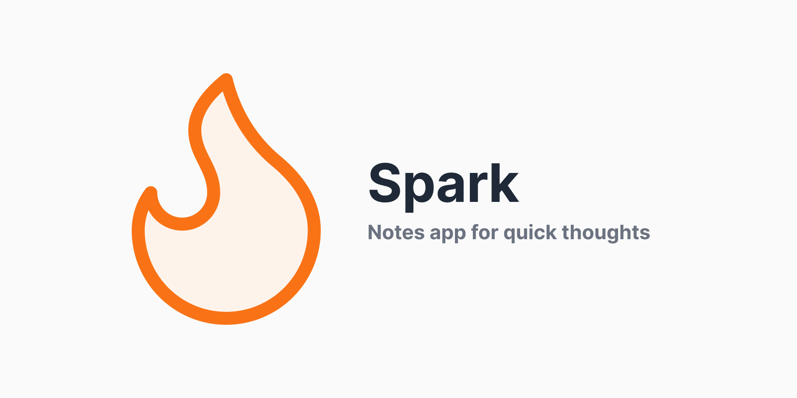
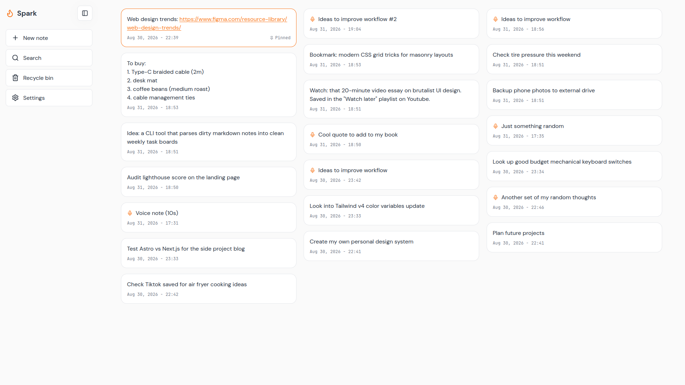
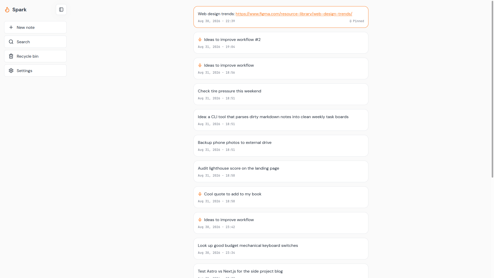
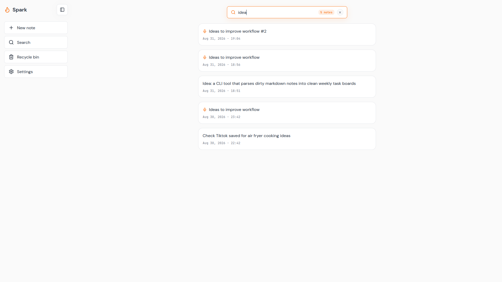
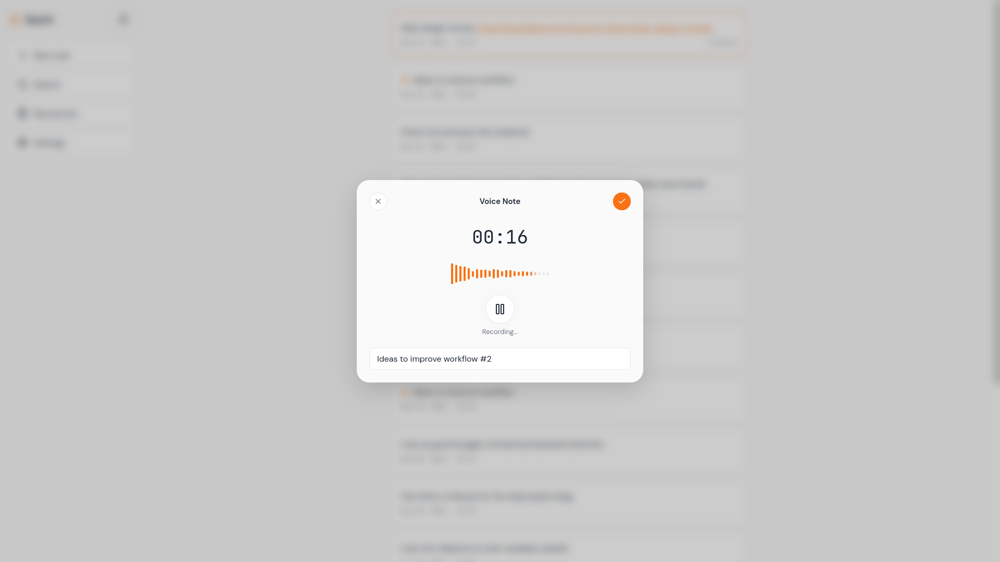
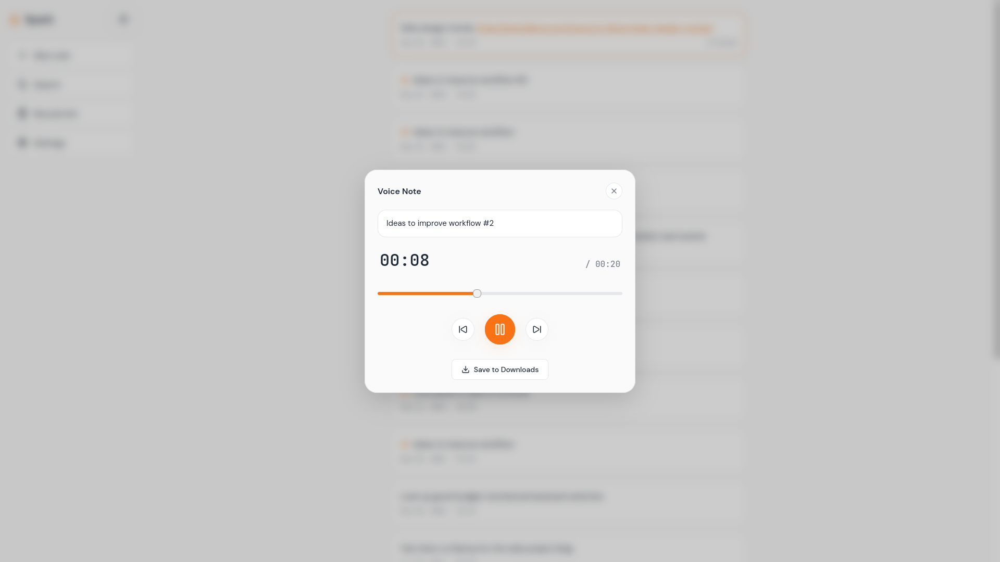
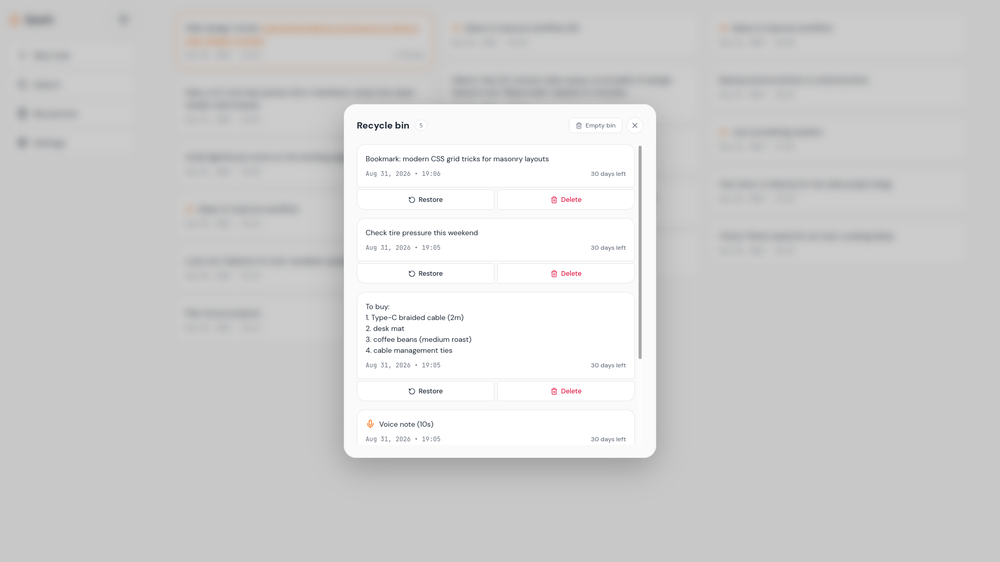
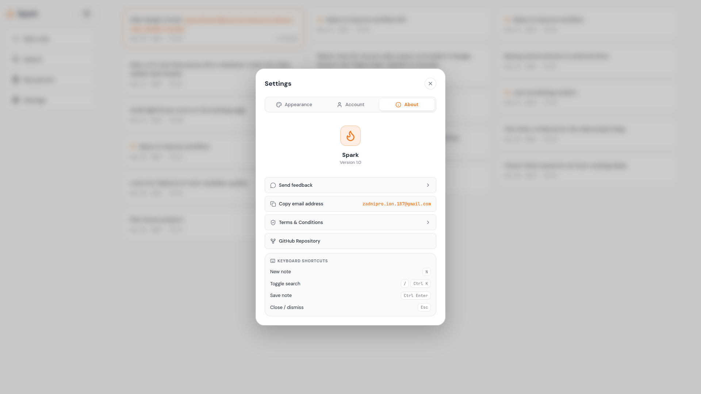

# Spark Web

A quick-thought web app for capturing sudden ideas the moment they strike.

When you have a sudden idea (a spark), note it down instantly, then revisit and organize it whenever you're ready. Built with a focus on speed, fluid interactions, keyboard accessibility, and offline-first reliability.

Current app version: 1.0.

Live App: [zadniproion-spark.netlify.app](https://zadniproion-spark.netlify.app/)

> Looking for the mobile version? Check out [Spark (Flutter)](https://github.com/ZadniproIon/spark) and [Download the Android APK](https://github.com/ZadniproIon/spark/releases/tag/v1.0).

> Note: Spark Web is under active development. While all core features (note-taking, audio recording, search, and cloud sync) are fully operational, subtle animation transitions and minor edge cases are continuously being polished.

---

## Screenshots

### Masonry Grid Layout


### Single Column View


### Floating Instant Search


### Voice Note Recording & Live Waveform


### Voice Player Sheet


### Recycle Bin & 30-Day Auto-Retention


### Settings & Themes


---

## Platforms & Links

- Live Web App: [zadniproion-spark.netlify.app](https://zadniproion-spark.netlify.app/)
- Web Repository: [Spark Web Repository](https://github.com/ZadniproIon/spark-web)
- Android App (Flutter): [Spark Flutter Repository](https://github.com/ZadniproIon/spark) | [Download Spark v1.0 APK](https://github.com/ZadniproIon/spark/releases/tag/v1.0)

---

## Tech Stack

- React 19 & TypeScript – UI architecture and state management
- Vite – Build tool and development server
- Supabase – Authentication, PostgreSQL database, and cloud storage
- Web Audio API – Voice note recording, real-time waveform visualization, and audio playback

---

## Features

- Quick note creation with keyboard shortcuts and distraction-free modals
- Voice notes with live audio waveform meters, pause/resume, and custom titling
- Audio player sheet with interactive scrubber and duration tracking
- Multi-column masonry and single-column layout options
- Instant search overlay with live filtering (`/` or `Ctrl + K`)
- Right-click context menu for pinning, editing, copying, downloading audio, and deleting
- Recycle bin with instant restore and 30-day automatic retention
- Automatic URL detection with direct clickable links
- Local guest mode and real-time cloud sync with Supabase
- Mobile responsive layout with slide-over drawer and touch controls
- Dark, light, and system themes

---

## Keyboard Shortcuts

| Action | Shortcut |
|---|---|
| New Note | <kbd>N</kbd> |
| Search Notes | <kbd>/</kbd> or <kbd>Ctrl</kbd> + <kbd>K</kbd> |
| Save Note | <kbd>Ctrl</kbd> + <kbd>Enter</kbd> |
| Close Modal / Dismiss | <kbd>Esc</kbd> |

---

## Project Setup

### 1. Install Dependencies

```bash
npm install
```

### 2. Run Development Server

```bash
npm run dev
```

### 3. Build for Production

```bash
npm run build
npm run preview
```


